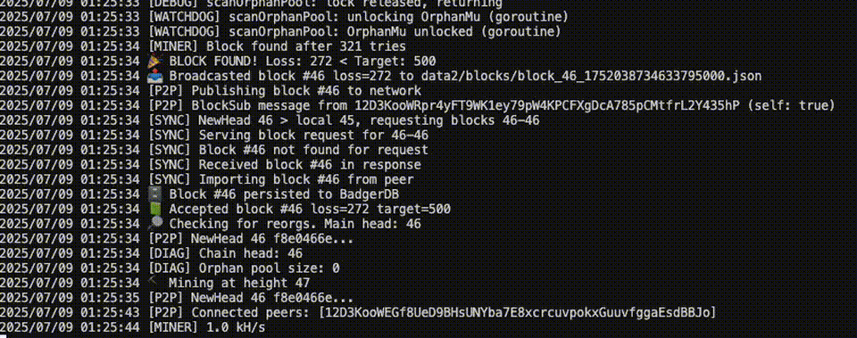

# PoAI: A "Proof-of-AI" Sovereign EVM-Compatible Blockchain

## ✨ Status: PoAI **v0.2.0-alpha** — “Stub-Miner” Release
This tag is an **MVP** that proves the chain mechanics with a real LLM model (TinyLlama-1.1B-Chat-GGUF) integrated for deterministic inference to solve (mine) blocks. Expect rapid churn and breaking changes.

### What works
- ✔️ **Genesis + block format** (`header.Header`, JSON-serialised, Keccak-256 hash)
- ✔️ **LLM-powered block solving** (TinyLlama-1.1B-Chat-GGUF via go-llama.cpp; deterministic, on-chain inference for mining/validation)
- ✔️ **Local mining loop**
  * Real LLM forward pass over procedural or test dataset
  * Proof-of-Work style target; difficulty retarget scaffolding in place
- ✔️ **Two-node P2P sync** (libp2p pubsub, manual multiaddr connect, mDNS discovery)
- ✔️ **Orphan-pool scanner** + periodic watchdog
- ✔️ **Pluggable dataset** (`--test-corpus` flag) with 100-Q&A demo set
- ✔️ **BadgerDB persistence** (+ automatic re-index on boot)

### What doesn’t work yet
- ❌ **Economic layer** (transactions, block rewards, slashing)
- ❌ **State trie / smart-contract logic** — `StateRoot` is a stub
- ❌ **Security hardening** (DoS protection, peer auth, fork-choice tweaks)
- ❌ **Distributed inference** — multi-GPU workers & on-chain weight updates planned
- ❌ **On-chain model rotation** — DAO contracts are stubs; no live governance for model updates
- ❌ **Metrics, monitoring, and production ops**

### Why release now?
Early feedback > silent perfection.  
If you can spin up two nodes, mine blocks, and watch them stay in sync, **please open an issue** with logs, questions, or design critiques.

> ⚠️ **Not production-ready.** Keys, balances, and blocks will be
> incompatible with future versions. Use on test machines only.




> **Abstract**  
> PoAI replaces hash-based proof-of-work with verifiable inference: miners grind on forward-passes of a fixed AI model over encrypted minibatches, producing blocks when the batch loss (hash-reduced to a 256-bit integer) falls below a network-wide difficulty target. An on-chain DAO rotates both the reference model weights and the hidden dataset each epoch, while an upcoming inference-market smart contract lets users post paid AI jobs secured by stake-slash guarantees.

---

## 1 Introduction

Modern blockchains rely on wasted SHA-256 or Ethash cycles to secure consensus. PoAI harnesses that compute for _useful_ work—running AI inferences—and still preserves the "straight, no-fork" security model of Bitcoin:

- **Deterministic proof**: every block header includes a "quiz loss" that any full node can recompute via a forward-only pass.
- **Difficulty retarget**: the loss threshold auto-adjusts to maintain a fixed block cadence.
- **On-chain governance**: Solidity-based DAOs (`ModelRegistry.sol`, `DatasetDAO.sol`) hot-swap the model snapshot and encrypted corpus on a timelocked, epoch-boundary schedule.
- **EVM compatibility**: deploy and interact with PoAI contracts exactly as you would on Ethereum.

---

## 2 Protocol Overview

### 2.1 Quiz-Based Consensus

1. **Epoch math**  
   - `EpochBlocks` (e.g. 2016 on main-net) defines each epoch's length.  
   - Seed = block-hash of the _previous_ epoch's last block.  

2. **EpochKey derivation**  
   ```text
   epochKey = Keccak256( seed ∥ epochIndex )
   ```

3. **Index selection**

   * A VRF or simple hash selects a minibatch of K sample IDs from the encrypted dataset.

4. **Fetch & decrypt**

   * Records encrypted under AES-GCM with per-record keys derived from `epochKey`.
   * Deterministic `mmapSlice` ➔ verify SHA-256 header ➔ `aesgcm.Open`.

5. **Forward-pass & loss reduction**

   * Fixed, "eval"-mode AI model (e.g. Llama 7B) runs K sample forward-passes.
   * Compute scalar loss → hash-reduce to 256-bit integer ℓ̂.
   * Block is valid if `ℓ̂ < T` (difficulty target).

### 2.2 Block Production & Verification

* **Miner** runs a single-goroutine loop driven by `state.SubscribeHeads()`, attempts quizzes on each tip, and broadcasts valid blocks via libp2p (stubbed today).
* **Validator** replays the same quiz pipeline in `validator/verify.go` and rejects any block with mismatched ℓ̂ or header.

---

## 3 Economic Model

* **Block subsidy**: 5 POAI per block (halving every 4 years).
* **Transaction fees**: gas charged in POAI for all EVM calls.
* **Inference-job fees**: posters lock POAI in `InferenceMarket.sol`; miners stake additional POAI and earn payments upon successful proof or get slashed on fraud.
* **Stake-slash**: invalid blocks lose GPU cost; mis-served jobs burn 90 % of worker stake, 10 % to challenger.
* **Security budget**: subsidy + fees + job revenues align miner incentives to remain honest.

---

## 4 On-Chain Governance

### 4.1 ModelRegistry.sol

* Propose new weight snapshot (CID, parameter count, SHA-256 hash, activationEpoch).
* Token-weighted vote + timelock ensures orderly upgrades.

### 4.2 DatasetDAO.sol

* Propose encrypted dataset CID + key-hash for each epoch.
* Commit-reveal pattern: key is only published at activation boundary to prevent precomputation.

Full-nodes and miners subscribe to events, prefetch assets, and switch atomically at each epoch boundary.

---

## 5 Current Status & Roadmap

| Component                                         | Status            | Notes |
| ------------------------------------------------- | ----------------- | ----- |
| Quiz pipeline & golden-vector tests               | ✅ Complete       |  |
| Single-worker mining loop & orphan-pool import    | ✅ Complete       |  |
| EVM governance stubs (ModelRegistry & DatasetDAO) | ⚪️ Stub           | Only DatasetDAO.sol exists, as a placeholder/stub. No ModelRegistry.sol |
| Difficulty retarget (core/difficulty.go)          | ✅ Complete       | Difficulty adjustment logic is implemented. |
| Persistent on-disk DB + pruning (core/storage)    | ✅ Complete       | BadgerDB-backed storage with block pruning implemented. |
| libp2p gossip & peer discovery (net/p2p.go)       | ✅ Complete       | Full implementation: block gossip, mDNS, sync, peer tracking. |
| **LLM-powered inference for block solving (TinyLlama, go-llama.cpp)** | ✅ Complete & integrated | Deterministic, on-chain LLM inference for mining/validation (solving blocks). |
| InferenceMarket.sol + Go bindings                 | ⚪️ Missing        | No InferenceMarket.sol or Go bindings yet. |
| Metrics & Grafana exporter                        | ⚪️ Missing        | No metrics or exporter code yet. |
| Documentation & spec polish                       | ⚪️ Stub           | All docs (spec, API, threat model) are stubs. |

---

## 6 Build & Run (with LLM Inference)

### Prerequisites
- Go 1.21+
- C compiler (clang recommended)
- (macOS) Metal support for GPU acceleration (optional)

### 1. Clone and Prepare

```sh
git clone https://github.com/YOUR_ORG/poai.git
cd poai
# If go-llama.cpp is a submodule:
git submodule update --init --recursive
```

### 2. Download a Supported LLM Model

Download a GGUF model supported by llama.cpp, e.g. TinyLlama-1.1B-Chat-GGUF:

```sh
mkdir -p models
curl -L -o models/TinyLlama-1.1B-Chat-v1.0.Q4_K_M.gguf \
  https://huggingface.co/TheBloke/TinyLlama-1.1B-Chat-v1.0-GGUF/resolve/main/TinyLlama-1.1B-Chat-v1.0.Q4_K_M.gguf
```

### 3. Build the Daemon

```sh
cd poai
# For Metal (Apple GPU) support:
CGO_LDFLAGS="-framework Metal -framework Foundation" go build -o poaid ./cmd/poaid
# Or for CPU-only:
go build -o poaid ./cmd/poaid
```

### 4. Run the Node with LLM Inference

```sh
./poaid --model-path=models/TinyLlama-1.1B-Chat-v1.0.Q4_K_M.gguf --gpu-layers=20 --data-dir=data1 --p2p-port=4001 --test-corpus=./dataset/testdata --target=500
```
- Adjust `--gpu-layers` for your hardware (0 = CPU only).
- Use a higher `--target` for easier/faster mining in test mode.

### 5. (Optional) Run a Second Node

```sh
./poaid --model-path=models/TinyLlama-1.1B-Chat-v1.0.Q4_K_M.gguf --gpu-layers=20 --data-dir=data2 --p2p-port=4002 --test-corpus=./dataset/testdata --peer-multiaddr="/ip4/127.0.0.1/tcp/4001/p2p/<PEER_ID_FROM_NODE_1>"
```

---

## Notes
- Do **not** commit model files or go-llama.cpp build artifacts to the repo.
- The LLM is used for deterministic inference only (no training).
- For best results, use a model and llama.cpp version known to be compatible.

---

## 6 Getting Involved

We're polishing PoAI's core before open-sourcing the repo. If you:

* Write Go, Solidity, or Rust
* Build distributed systems or GPU kernels
* Are passionate about decentralized AI

…join our Discord at **gswarm.dev** or open an Issue/PR on GitHub once the repo goes live.

---

## 7 License & Code of Conduct

* **Apache 2.0** for all code.
---

*PoAI unites provable AI work with blockchain security. Stay tuned for the public repo — together we'll finish the last mile to a live test-net and beyond.* 
